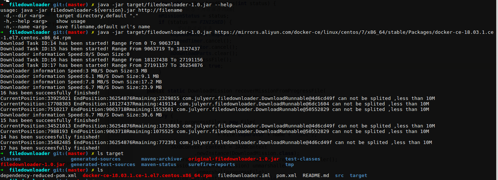
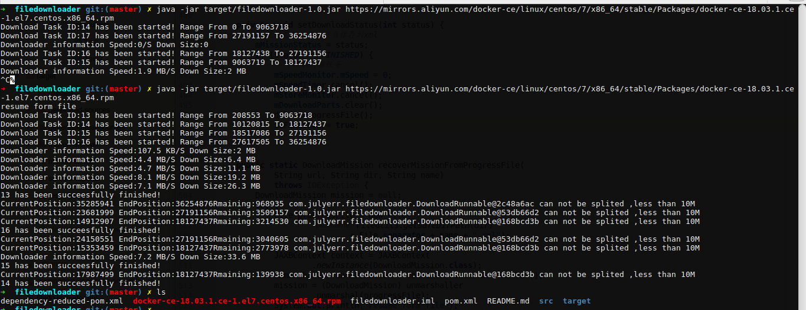
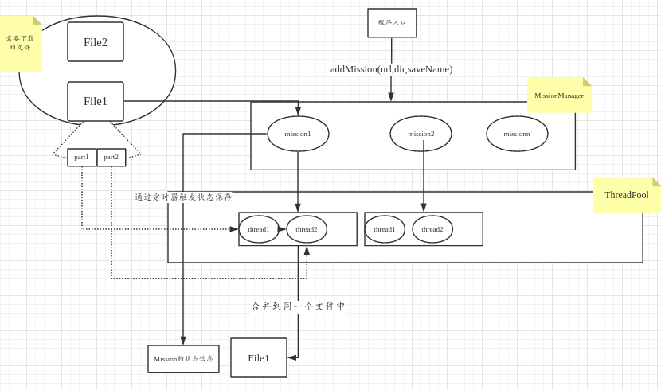

多线程下载器

### 效果展示

### 项目特色

- 并发线程下载任务的动态分担（先下载完成的线程会分担其他线程工作量）
- 实时速度显示
- 断点续传
- 提供命令行工具

### 快速开始

- `github clone && cd filedownloader `
- `mvn package`
- `java -jar target/filedownloader-1.0.jar --help`

### 项目简析

整个workfow

对应blog[分析](http://julyerr.club/2018/04/21/multithread-downloader/)

### 感谢

- 项目设计思路和实现主要[参考](https://github.com/daimajia/java-multithread-downloader.git)
- 本项目可以作为多线程开发实践的一个项目，欢迎大家借鉴学习 